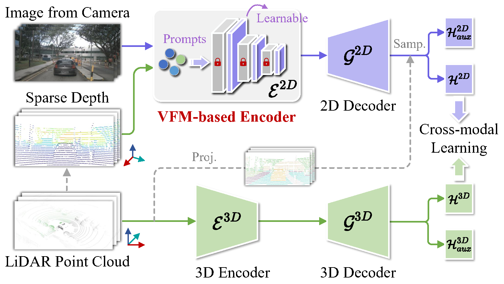

# UniDSeg: Unified Cross-Domain 3D Semantic Segmentation via Visual Foundation Models Prior [NeurIPS 2024]

:fire: This is the official PyTorch implementation of our work. :fire:

## Overview


## News
* **2024-10** :loudspeaker: Our new work, [UniDSeg](https://proceedings.neurips.cc/paper_files/paper/2024/file/b762632135b16f1225672f9fe2a9740b-Paper-Conference.pdf), has been accepted by NeurIPS 2024.
* **2024-05** :rocket: We release the first version of code.

## TODO
* :white_medium_square: Run all experiments use SAM.
* :white_medium_square: Refactor the code.

## Getting Started

### Installation

The implementation runs on
- Python 3.8
- Torch 1.9.0
- Torchvision 0.10.0
- CUDA 11.1
- [Spatial Sparse Convolution Library (SpConv 2.1)](https://github.com/traveller59/spconv)
- [nuscenes-devkit 1.1.10](https://github.com/nutonomy/nuscenes-devkit)
- [mmcv 2.1.0](https://github.com/open-mmlab/mmcv)
- [mmsegmentation 1.2.2](https://github.com/open-mmlab/mmsegmentation)

### Preparation
As for 3D networks, we use SpConv instead of SparseConvNet used in xMUDA_journal, which is faster to compute. We advise to create a new conda environment for installation. PyTorch and CUDA can be installed, and SpConv installed/compiled as follows:
```
git clone https://github.com/traveller59/spconv, cd ./spconv, pip install -e .
```

### Pre-trained CLIP Models
Download the pre-trained CLIP (ViT-B-16.pt, ViT-L-14.pt) and SAM (sam_vit_l.pth) models and save them to the ./pretrained folder. The download links can be found in [the official repo](https://github.com/openai/CLIP/blob/a1d071733d7111c9c014f024669f959182114e33/clip/clip.py#L30)

### Dataset (Refer to [xMUDA_journal](https://github.com/valeoai/xmuda_journal))
You need to perform preprocessing to generate the data for UniDSeg.

NuScenes:
- Please download the Full dataset (v1.0) from the [NuScenes website](https://www.nuscenes.org/) and extract it.
- Please edit the script xmuda/data/nuscenes/preprocess.py as follows and then run it.
  - ```root_dir``` should point to the root directory of the NuScenes dataset.
  - ```out_dir``` should point to the desired output directory to store the pickle files.

A2D2:
- Please download the Semantic Segmentation dataset and Sensor Configuration from the [Audi website](https://www.a2d2.audi/a2d2/en/download.html) or directly use ```wget``` and the following links, then extract.
- Please edit the script xmuda/data/a2d2/preprocess.py as follows and then run it.
  - ```root_dir``` should point to the root directory of the A2D2 dataset.
  - ```out_dir``` should point to the desired output directory to store the undistorted images and pickle files. It should be set differently than the ```root_dir``` to prevent overwriting of images.

SemanticKITTI:
- Please download the files from the [SemanticKITTI website](http://semantic-kitti.org/dataset.html) and additionally the [color data](http://www.cvlibs.net/download.php?file=data_odometry_color.zip) from the [Kitti Odometry website](https://www.cvlibs.net/datasets/kitti/eval_odometry.php). Extract everything into the same folder. Similar to NuScenes preprocessing, we save all points that project into the front camera image as well as the segmentation labels to a pickle file.
- Please edit the script xmuda/data/semantic_kitti/preprocess.py as follows and then run it.
  - ```root_dir``` should point to the root directory of the SemanticKITTI dataset.
  - ```out_dir``` should point to the desired output directory to store the pickle files.

VirtualKITTI:
- Clone the repo from [VirtualKITTI website](https://github.com/VisualComputingInstitute/vkitti3D-dataset.git).
- Download raw data and extract with following script.
  ```
  cd vkitti3D-dataset/tools
  mkdir path/to/virtual_kitti
  bash download_raw_vkitti.sh path/to/virtual_kitti
  ```
- Generate point clouds (npy files).
  ```
  cd vkitti3D-dataset/tools
  for i in 0001 0002 0006 0018 0020; do python create_npy.py --root_path path/to/virtual_kitti --out_path path/to/virtual_kitti/vkitti_npy --sequence $i; done
  ```
- Similar to NuScenes preprocessing, we save all points and segmentation labels to a pickle file.
- Please edit the script `xmuda/data/virtual_kitti/preprocess.py` as follows and then run it.
  - `root_dir` should point to the root directory of the VirtualKITTI dataset.
  - `out_dir` should point to the desired output directory to store the pickle files.

## Usage
### Training DG
```
cd <root dir of this repo>
CUDA_VISIBLE_DEVICES=0 python -W ignore xmuda/train_dg_clip_UniDSeg.py --cfg=configs/dataset_name/dg.yaml
CUDA_VISIBLE_DEVICES=0 python -W ignore xmuda/train_dg_sam_UniDSeg.py --cfg=configs/dataset_name/dg.yaml
```
### Training UDA
```
cd <root dir of this repo>
CUDA_VISIBLE_DEVICES=0 python -W ignore xmuda/train_da_clip_UniDSeg.py --cfg=configs/dataset_name/da.yaml
CUDA_VISIBLE_DEVICES=0 python -W ignore xmuda/train_da_sam_UniDSeg.py --cfg=configs/dataset_name/da.yaml
```
### Training SFDA
```
cd <root dir of this repo>
CUDA_VISIBLE_DEVICES=0 python -W ignore xmuda/train_sfda_clip_UniDSeg.py --cfg=configs/dataset_name/sfda.yaml
CUDA_VISIBLE_DEVICES=0 python -W ignore xmuda/train_sfda_sam_UniDSeg.py --cfg=configs/dataset_name/sfda.yaml
```
You can change the path OUTPUT_DIR in the config file `xxx.yaml` and `xxx_pl.yaml`.

### Testing
You can run the testing with:
```
cd <root dir of this repo>
CUDA_VISIBLE_DEVICES=0 python -W ignore xmuda/test_ft_clip.py \
    --cfg=./configs/nuscenes/a2d2_skitti/dg.yaml \
    --ckpt2d=./output/a2d2_skitti/UniDSeg/best_model_2d.pth \
    --ckpt3d=./output/a2d2_skitti/UniDSeg/best_model_3d.pth
```

### Re-training with pseudo-labels for UDA
After having trained the UniDSeg model, generate the offline pseudo-labels as follows:
```
cd <root dir of this repo>
CUDA_VISIBLE_DEVICES=0 python -W ignore xmuda/test_ft_clip.py \
    --cfg=configs/nuscenes/a2d2_skitti/uda/da_pl.yaml \
    --ckpt2d=./output/a2d2_skitti/UniDSeg/final_model_2d.pth \
    --ckpt3d=./output/a2d2_skitti/UniDSeg/final_model_3d.pth \
    --pselab \
    DATASET_TARGET.TEST "('train',)"
```
Note that we use the last model at final steps to exclude supervision from the validation set by picking the best weights. The pseudo labels and maximum probabilities are saved as ```.npy``` file.

Please edit the ```pselab_paths``` in the config file, e.g. ```configs/nuscenes/a2d2_skitti/da_pl.yaml```, to match your path of the generated pseudo-labels.
Then start the training. The pseudo-label refinement (discard less confident pseudo-labels) is done when the dataloader is initialized.

## Acknowledgements

Code is built based on [xMUDA_journal](https://github.com/valeoai/xmuda_journal) and [FtD++](https://github.com/Barcaaaa/FtD-PlusPlus).

## Citation

If you find this project useful, please consider citing:
```bibtex
@inproceedings{DBLP:conf/nips/WuX0L0Q24,
  author       = {Yao Wu and
                  Mingwei Xing and
                  Yachao Zhang and
                  Xiaotong Luo and
                  Yuan Xie and
                  Yanyun Qu},
  title        = {UniDSeg: Unified Cross-Domain 3D Semantic Segmentation via Visual
                  Foundation Models Prior},
  booktitle    = {Advances in Neural Information Processing Systems 38: Annual Conference
                  on Neural Information Processing Systems 2024, NeurIPS 2024, Vancouver,
                  BC, Canada, December 10 - 15, 2024},
  year         = {2024},
}
```
